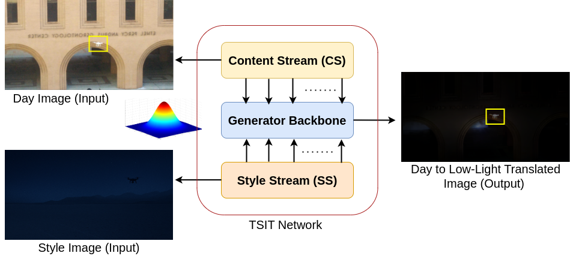
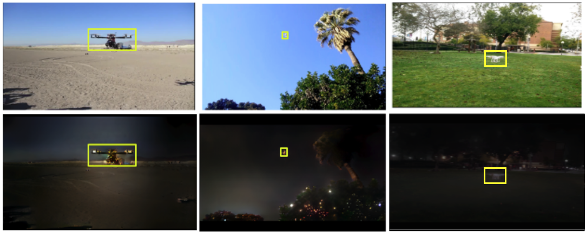
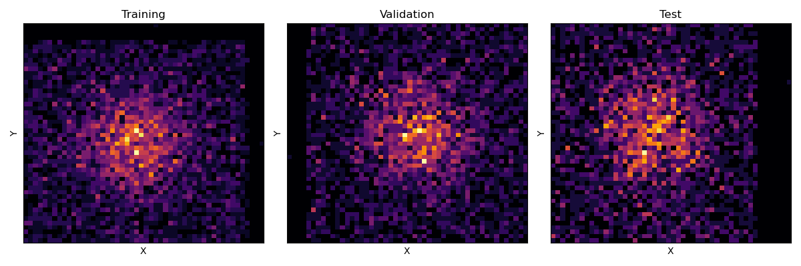
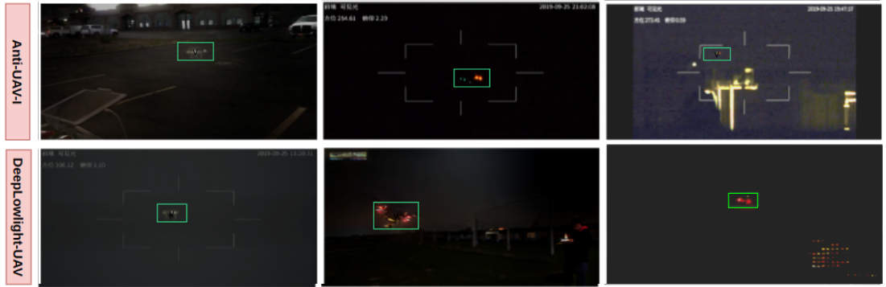

# Co-LLIETrack: Co-trained Low Light Image Enhancement-Tracker for UAV Tracking

  

## 🔍 Abstract

Tracking unmanned aerial vehicles (UAVs) in **low-light conditions** is challenging due to poor visibility, noise, and lack of suitable datasets. Existing LLIE-Tracker frameworks primarily target **UAV-to-ground** tracking. In contrast, this work extends the framework to **ground-to-UAV** tracking and proposes:

- A **co-training strategy** using a novel loss function — **Semantic Feature Map with IOU Matching (SFMIOU) loss** — to jointly train the image enhancer and tracker.
- A **synthetic dataset**, **DeepLowLight-UAV**, generated using a DL-based day-to-night pipeline for training in diverse low-light scenarios.

**Comprehensive experiments** on the Anti-UAV-I benchmark show up to **4–6% improvements** in accuracy and real-time feasibility (>30 FPS).

---

## 🏗️ Framework Overview

### 📷 LLIE-Tracker System Architecture

  

---

## 🧾 Dataset Generation: TSIT Pipeline

  

This pipeline converts **daytime UAV images** into **realistic low-light versions** using style transfer from dark style images. This forms the backbone of our **DeepLowLight-UAV** dataset generation.

---

## 🖼️ Day vs Night Samples

  

Top Row: Daytime UAV Frames  
Bottom Row: Corresponding Low-Light Translated Frames

---

## 🛰️ Object Position Distribution

  

The above heatmaps show the **spatial distribution** of UAVs in the training, validation, and test subsets of the DeepLowLight-UAV dataset.

---

## 🆚 Real vs Synthetic Comparison

  

Top Row: Real low-light images from the **Anti-UAV-I** dataset  
Bottom Row: **DeepLowLight-UAV** samples generated synthetically using our TSIT + BSRGAN pipeline.

---

## 📩 Dataset Access

The **DeepLowLight-UAV** dataset is available for **non-commercial research use**.  
To request access, please send an email with your institutional details and intended use case to:

📧 **tushar.sangam@researchinvision.ai**

---
