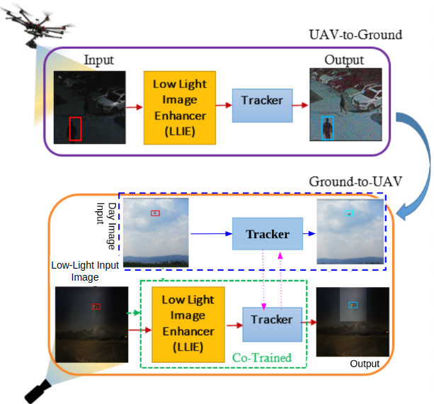
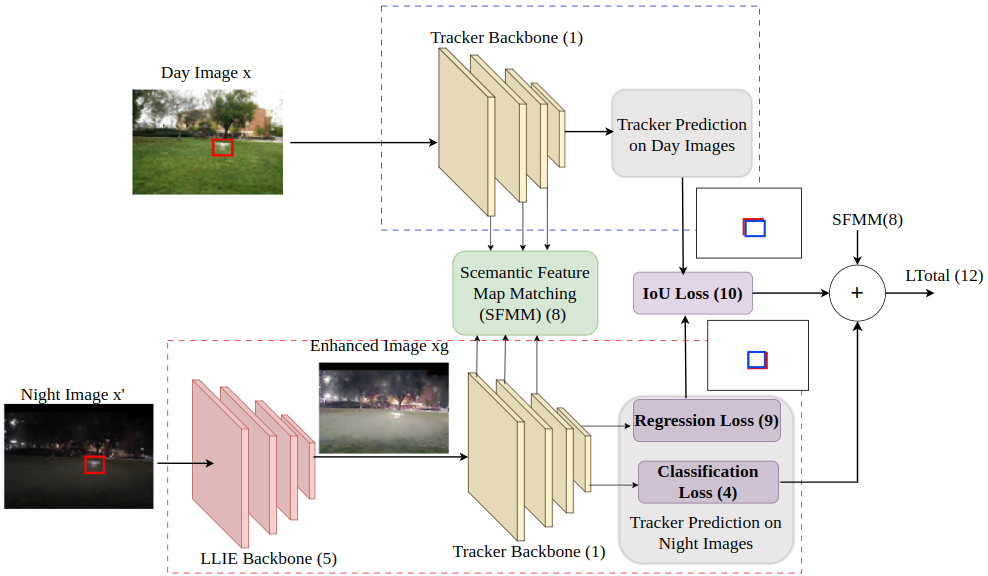
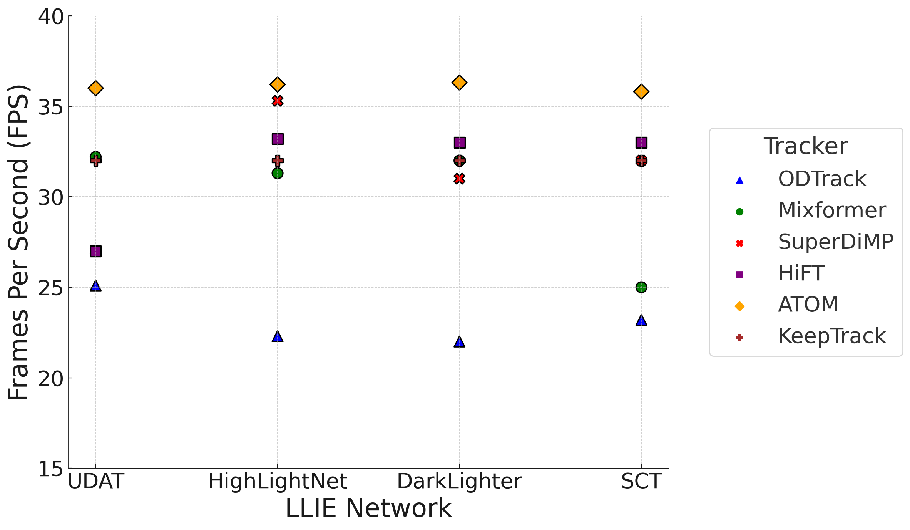

# Co-LLIETrack: Co-trained Low Light Image Enhancement-Tracker for UAV Tracking

<p align="center">
  
</p>

## 🔍 Abstract

Tracking unmanned aerial vehicles (UAVs) in **low-light conditions** is challenging due to poor visibility, noise, and lack of suitable datasets. Existing LLIE-Tracker frameworks primarily target **UAV-to-ground** tracking. In contrast, this work extends the framework to **ground-to-UAV** tracking and proposes:

- A **co-training strategy** using a novel loss function — **Semantic Feature Map with IOU Matching (SFMIOU) loss** — to jointly train the image enhancer and tracker.
- A **synthetic dataset**, **DeepLowLight-UAV**, generated using a DL-based day-to-night pipeline for training in diverse low-light scenarios.

**Comprehensive experiments** on the Anti-UAV-I benchmark show up to **4–6% improvements** in accuracy and real-time feasibility (>30 FPS).

---

## 🏗️ Framework Overview

### 📷 LLIE-Tracker System Architecture

The system supports **UAV-to-Ground** and **Ground-to-UAV** tracking using co-training of the LLIE module and Tracker.

<p align="center">
  
</p>

### 🚀 Performance Analysis (FPS)

<p align="center">
  
</p>

---

## 📦 Project Structure

```
Co-LLIETrack/
│
├── dataset/                     # Dataset scripts and instructions
│   ├── DeepLowLight-UAV/       # Synthetic low-light dataset (optional download)
│
├── models/                     # LLIE and Tracker models
│   ├── HighLightNet/
│   ├── DarkLighter/
│   └── SCT/
│
├── training/                   # Co-training pipeline code
│   └── sfmiou_loss.py
│
├── inference/                  # Test scripts
│   └── run_tracker.py
│
├── utils/
│   └── visualization.py
│
├── LLIETracker/  
├── README.md                   # This file
└── requirements.txt
```

---

## 🧪 Getting Started

### 🔧 Installation

```bash
git clone https://github.com/yourusername/Co-LLIETrack.git
cd Co-LLIETrack
pip install -r requirements.txt
```

### 📁 Dataset Preparation

1. **Download Anti-UAV-I dataset**: [Anti-UAV Benchmark](https://anti-uav.github.io/leaderboard/)
2. **Generate Synthetic Data** using `dataset/deeplowlight_generator.py` (based on TSIT and BSRGAN)
3. Place data in `dataset/DeepLowLight-UAV/`

---

## 🏃‍♂️ Training

```bash
python training/train_sfmiou.py --config configs/highlightnet_mixformer.yaml
```

This performs **2-stage training**:
- Stage 1: Pretrain tracker on daytime UAV images
- Stage 2: Co-train LLIE + tracker on synthetic low-light data with **SFMIOU loss**

---

## 🧠 Evaluation

```bash
python inference/run_tracker.py --dataset anti-uav-i --tracker MixFormer --llie HighLightNet
```

Outputs tracking predictions, performance metrics (precision/IoU), and FPS.

---

## 📊 Key Results

### ✅ Co-Training Performance Gains

| LLIE Method   | Tracker       | Separate | Co-Trained | Gain (%) |
|---------------|---------------|----------|------------|----------|
| HighLightNet  | SiamAPN++     | 0.591    | 0.607      | +2.7     |
| SCT           | ATOM          | 0.641    | 0.677      | +5.6     |
| DarkLighter   | SuperDiMP     | 0.778    | 0.795      | +2.1     |
| UDAT          | ODTrack       | 0.648    | 0.674      | +4.0     |

> See full results in the paper (Table IV–VI) and figures 9–14 for attribute-based and qualitative evaluations.

---

## 🗂 Dataset: DeepLowLight-UAV

| Metric          | Value     |
|-----------------|-----------|
| Sequences       | 55        |
| Frames          | 74,025    |
| Source          | Day-to-Night via TSIT + BSRGAN |
| Annotations     | Bounding Boxes (from day images) |
| Augmentation    | Blur, Noise, Contrast Variations |

---

## 📌 Highlights

- ⚡ **Real-Time**: Avg FPS >30 (ATOM: 36.3 FPS)
- 📈 **Improved LLIE Quality**: Co-training improves PSNR of enhancement outputs by up to 7.4%
- 🎯 **Generalizable**: Works well even when trained only on synthetic data

---

## 📄 Citation

If you find this work helpful, please cite:

```bibtex
@article{CoLLIETrack2025,
  title     = {Co-LLIETrack: Co-trained Low Light Image Enhancement-Tracker for UAV Tracking},
  author    = {Tushar Sangam and collaborators},
  journal   = {IEEE Journal of LaTeX Class Files},
  year      = {2025},
  note      = {arXiv preprint arXiv:XXXX.XXXXX}
}
```

---

## 🤝 Acknowledgements

- [Anti-UAV Benchmark](https://anti-uav.github.io/leaderboard/)
- TSIT, BSRGAN, HighLightNet, Mixformer authors
- Dataset annotation support via `LabelImg`

---

## 📬 Contact

For questions or contributions, please open an issue or reach out at:
**email@example.com**
